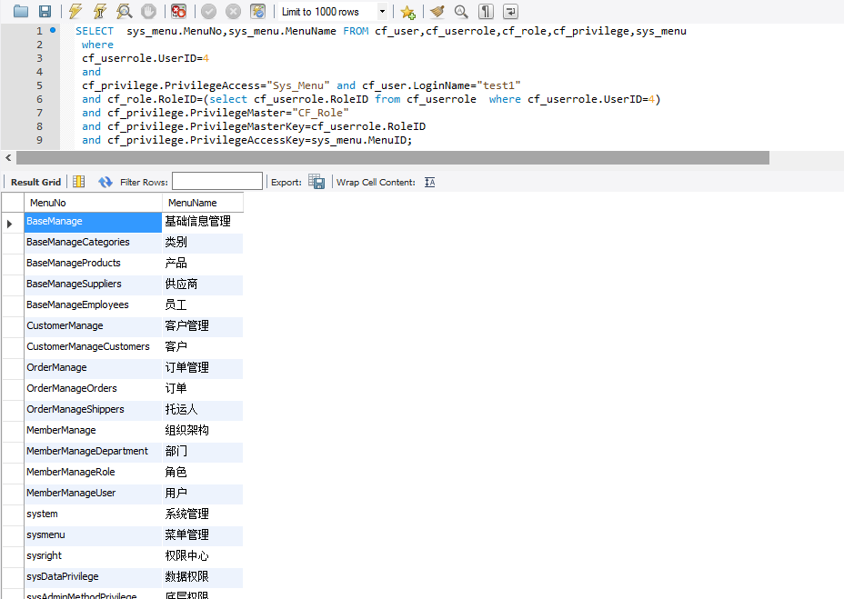

# zuoye6
<h1>test1可以查看的页面（Sys_menu）</h1>
  
<h2>伪代码：</h2>
 1、根据用户名称查询用户ID
 2、根据用户ID查对应角色
 3、for每一个角色
 从权限表中查角色对应权限ID
 合并角色的权限集合
 4、判断权限集合是否有查看权限
 5、If有
 输出对应页面
 Else
 不输出
<h1>操作权限(sys_button)</h1>

<h2>伪代码：</h2>：
 1、根据用户名称查询用户ID  
 2、根据用户ID查对应角色  
 3、for每一个角色  
 从权限表中查角色对应权限ID  
 合并角色的权限集合  
 4、查询权限集合中菜单名为“订单”的数据
 5、输出对应的权限
